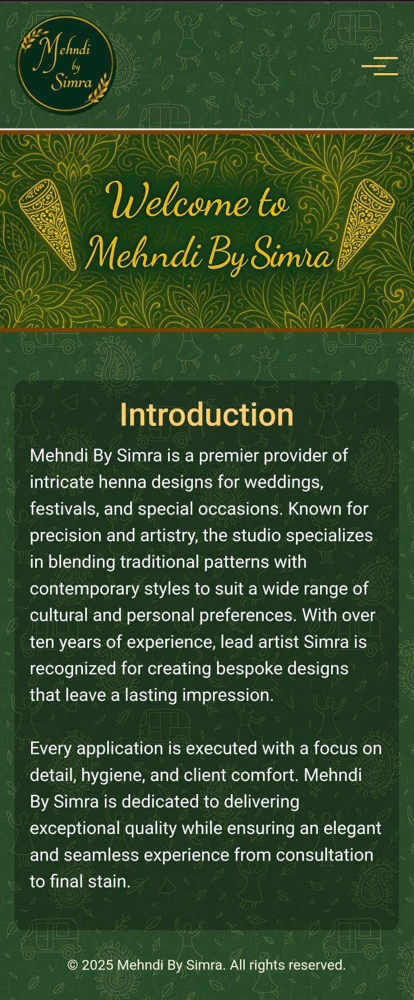
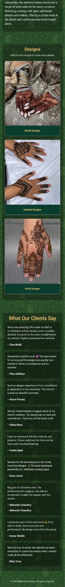
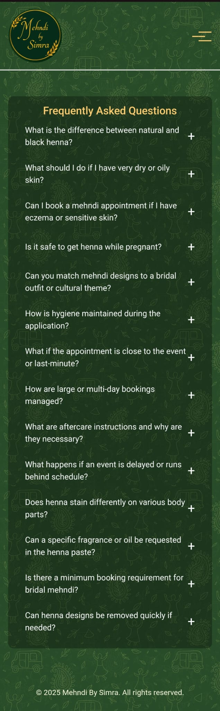
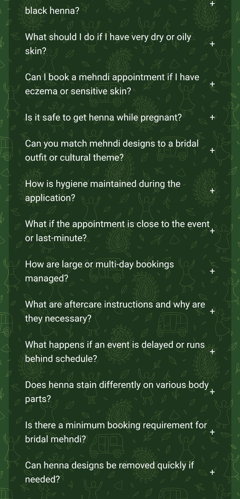
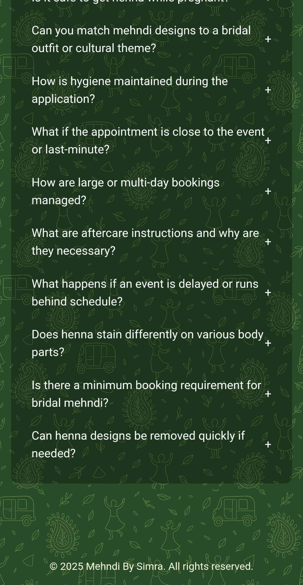
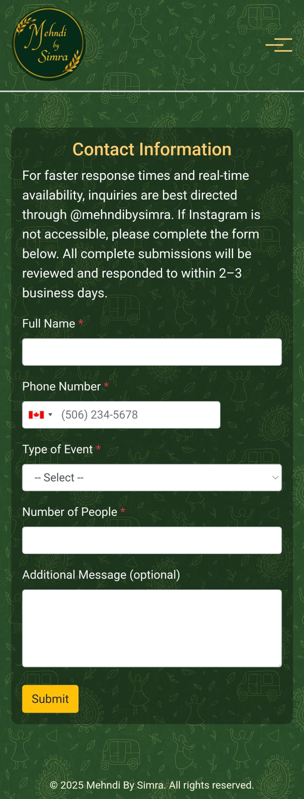
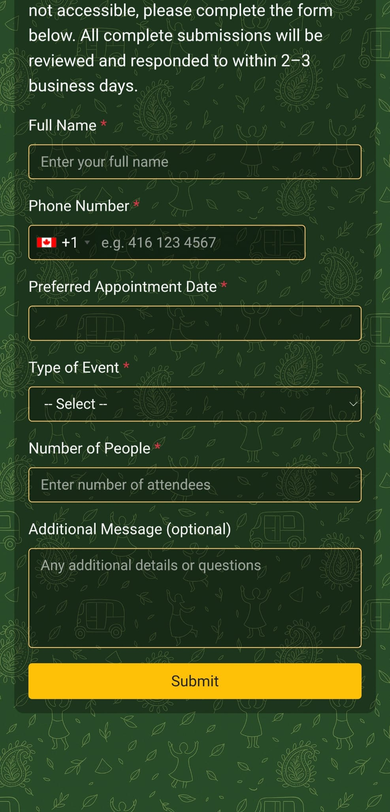
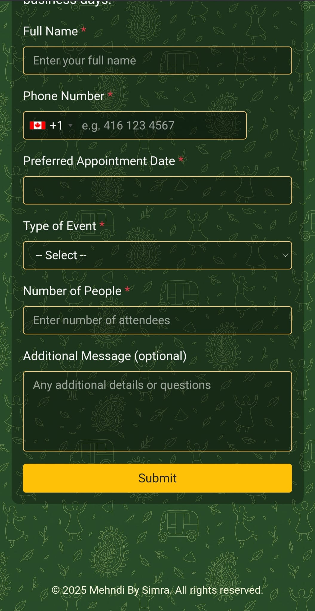

# Henna Artist Portfolio Website 🌿

A professionally designed, fully responsive portfolio website for a Henna artist. This site showcases the artist’s designs, services, client testimonials, and contact details in a sleek and modern layout, built with HTML, CSS, Bootstrap, and JavaScript.

## 🌐 Live Demo

👉 [View the website](https://mehndibysimra.netlify.app/)

## 💡 Features

- ✅ **Typing Animation**: Dynamic typing effect on desktop; falls back to static text on mobile for performance.  
- ✅ **Animated Background**: Subtle, continuously scrolling patterned background that pauses when you hover over the navbar or any content section (FAQ, portfolio, contact), adding depth without distraction.  
- ✅ **Dark Translucent Sections**: Every “intro” wrapper (FAQ, portfolio, contact) uses a semi-transparent black overlay, giving a moody, professional feel against the animated background.  
- ✅ **Consistent Hero Display**: On mobile devices, the hero image uses `background-size: contain` and a responsive padding trick so that the entire image always fits without cropping or jumping height.  
- ✅ **Fixed-Size Modal Gallery**: When you click any portfolio image, the lightbox modal stays the same size as you navigate between pictures and videos—no resizing or jarring layout shifts. All media inside is centered and scaled to fit within a max height of 80vh.  
- ✅ **Desktop vs. Mobile Navigation Hints**: The lightbox header shows “Use the ◀ ▶ arrows to navigate…” on desktop and “Swipe left or right to navigate…” on mobile, each inside a near-opaque black pill-shaped container so the text remains legible against any background.  
- ✅ **Image/Video Gallery**: Three portfolio categories (Bridal, Festival, Party) open a Bootstrap modal with arrow buttons (desktop) or swipe gestures (mobile). Arrows are hidden on small screens, letting users swipe naturally.  
- ✅ **Client Reviews Section**: A realistic, dynamic grid of client photos and testimonials that load on scroll—keeps the page engaging without overwhelming initial load times.  
- ✅ **FAQ Accordion**: A fully accessible, Bootstrap-powered collapse/accordion design for frequently asked questions. The FAQ section uses flexbox to push the footer to the bottom if content is short.  
- ✅ **Contact Form**:  
  - Uses **intl-tel-input** in separate-dial-code mode (country dropdown with flag + dial code).  
  - Israel is intentionally excluded from the phone dropdown.  
  - All form controls (inputs, selects, textareas, date picker) have a dark translucent background, gold border, and light text to fit the site theme.  
  - Date picker disables past dates.  
  - On successful submission (via Formspree), the form politely thanks the user, disables inputs, and displays a confirmation message.  
- ✅ **Sticky Footer**: Even on pages with little content (e.g. FAQ), the footer remains anchored at the bottom by making `#main-wrapper` a flex container and letting the main section grow.  
- ✅ **Fully Responsive**:  
  - Breakpoints for ≤768px and ≤576px ensure navbars collapse elegantly, font sizes adjust, and heavy hero animations are disabled on small screens.  
  - Portfolio cards and text scale and reflow across all device sizes.

## 🛠️ Built With

- **HTML5**  
- **CSS3** (with keyframe animations, flexbox, media queries)  
- **Bootstrap 4 & 5** (grid, accordion, modal)  
- **JavaScript (Vanilla)** (DOM manipulation, event listeners, `intl-tel-input`)  
- **Intl-Tel-Input** (for phone number formatting with country flags)  
- **GitHub** for version control  
- **Netlify** for deployment  

## 🚀 What I Contributed / Updated

1. **Modal Consistency**  
   - Fixed the lightbox “jumping” issue by setting a maximum width (800px) and height (80vh) on the modal dialog/body, so every image or video stays within the same frame.  
   - Adjusted `.modal-content`’s background to `rgba(0, 0, 0, 0.9)` so it’s almost opaque—text and controls remain clear against any backdrop.  

2. **Instruction Overlays**  
   - Added two instruction paragraphs (`.desktop-instruction` and `.mobile-instruction`) inside the modal.  
   - Wrapped their text in a near-opaque black container with subtle padding and rounded corners for legibility.  
   - Applied media queries so that “Use the ◀ ▶ arrows to navigate…” only shows on desktop, and “Swipe left or right to navigate…” only on mobile.  

3. **Hero Section on Mobile**  
   - Overrode `.hero` under `@media (max-width: 768px)` to use `background-size: contain` and a `padding-top: 50%` trick, ensuring the full hero image is visible and scales without cropping.  

4. **Form Styling & Behavior**  
   - Updated `select#eventType` and all `.form-control` fields so they use a dark translucent background (`rgba(0,0,0,0.2)`), a gold (`#ffcc70`) border, and light placeholder/text.  
   - Added CSS to hide the default white dropdown and restyle each `<option>` to match the site’s green/black theme.  
   - Kept Israel out of the phone dropdown by setting `excludeCountries: ["il"]` in the `intlTelInput` initialization.  

5. **Sticky Footer & Layout**  
   - Made `html, body { height: 100%; }` and `#main-wrapper { display: flex; flex-direction: column; min-height: 100%; }`.  
   - Ensured each `section.container { flex: 1; }`, so the footer stays at the bottom when there’s little content.  

6. **Portfolio Grid on Mobile**  
   - Overrode `.card-body` under `@media (max-width: 768px)` for `#designs`, forcing the green background to persist instead of falling back to gray.  
   - Kept the gold `.card-text` color intact.  

7. **FAQ Page**  
   - Loaded FAQ items via JavaScript into a Bootstrap accordion inside `#faqAccordion`.  
   - Ensured the collapse panels and container match the dark overlay look.  
   - Verified that the footer remains fixed even if the FAQ list is short.  

8. **Navbar & Responsive Tweaks**  
   - Refined the mobile navbar dropdown to appear beneath the toggler, with a gold border and dark background.  
   - Disabled heavy background overlays and hero animations at key breakpoints (≤768px, ≤576px) for performance.  

## 📷 Screenshot

  

 
 

